# PPS-Unidad3Actividad-ConfiguracionSeguraTLS
Actividad de configuración segura de TLS

Tenemos como objetivo:

> - Conocer el funcionamiento de protocolos de transimisión seguros SSL/TLS y como activarlos.
>
> - Aplicar cambios para prevenir ataques de configuración insegura.

# ¿Qué es TLS?
---

**TLS (Transport Layer Security)** es un protocolo criptográfico que proporciona comunicaciones seguras sobre redes de computadoras, especialmente en internet. Su objetivo principal es proteger la confidencialidad e integridad de los datos transmitidos entre aplicaciones, como navegadores web y servidores.

TLS es el sucesor de **SSL (Secure Sockets Layer)**. Aunque SSL fue ampliamente utilizado, sus versiones han quedado obsoletas debido a múltiples vulnerabilidades. Hoy en día, TLS en sus versiones 1.2 y 1.3 es el estándar de facto para la seguridad en la web.

**TLS proporciona:**

- **Confidencialidad:** gracias al cifrado de los datos en tránsito.
- **Integridad:** mediante funciones hash que detectan alteraciones.
- **Autenticación:** utilizando certificados digitales que identifican a las partes.

# ACTIVIDADES A REALIZAR
---
> Lee el siguiente [documento sobre Configuración Segura de TLS y Cifrado de Datos Sensibles con AES](./files/ConfiguracionTLSCifradoDatosAES.pdf)
> 
> También y como marco de referencia, tienes [ la sección de correspondiente de pruebas del **Proyecto Web Security Testing Guide** (WSTG) del proyecto **OWASP**.](https://owasp.org/www-project-web-security-testing-guide/v41/4-Web_Application_Security_Testing/09-Testing_for_Weak_Cryptography/01-Testing_for_Weak_SSL_TLS_Ciphers_Insufficient_Transport_Layer_Protection)
>


Vamos realizando operaciones:

## Iniciar entorno de pruebas

Situáte en la carpeta de del entorno de pruebas de nuestro servidor LAMP e inicia el escenario multicontendor:

~~~
docker-compose up -d
~~~

Para acceder a nuestro servidor apache:

~~~
docker exec -it lamp-php83 /bin/bash
~~~

## Habilitar HTTPS con SSL/TLS en Servidor Apache
---

Para proteger nuestro servidor es crucial habilitar HTTPS en el servidor local. Veamos cómo podemos habilitarlo en Apache con dos métodos diferentes.

### Obtención del certíficado

Para utilizar protocolos SSL tenemos que tener un certificado que indique quienes sómos. Podemos hacerlo de dos formas:

- Obtener un certificado autofirmado que nos sirva para un entorno local o de pruebas. 

- Obtener un certificado de un entidad certificadora.

#### Método 1: Obtener certificado con **OpenSSL**

1. Generamos un certificado SSL autofirmado

Para entornos de prueba o desarrollo, se puede utilizar un **certificado autofirmado**, es decir, un certificado que no ha sido emitido por una entidad de certificación.


**Paso 1: Crear la clave privada y el certificado**
---

Como estamos trabajando bajo docker, accedemos al servidor:

~~~
docker exec -it lamp-php83 /bin/bash
~~~

Comprobamos que están creados los directorios donde se guardan los certificados y creamos el certificado autofirmado:

~~~
mkdir /etc/apache2/ssl
cd /etc/apache2/ssl
openssl req -x509 -nodes -days 365 -newkey rsa:2048 -keyout localhost.key -out localhost.crt
~~~

**Explicación de los parámetros del comando:**

- `req`: inicia la generación de una solicitud de certificado.
- `-x509`: crea un certificado autofirmado en lugar de una CSR.
- `-nodes`: omite el cifrado de la clave privada, evitando el uso de contraseña.
- `-newkey rsa:2048`: genera una nueva clave RSA de 2048 bits.
- `-keyout server.key`: nombre del archivo que contendrá la clave privada.
- `-out server.crt`: nombre del archivo de salida para el certificado.
- `-days 365`: el certificado será válido por 365 días.

Durante la ejecución del comando, se te solicitará que completes datos como país, nombre de organización, y nombre común (dominio).

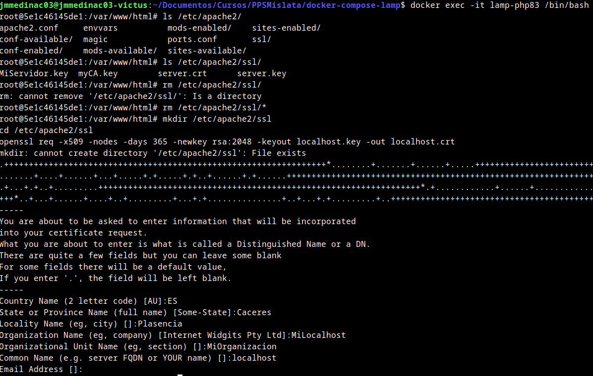

Vemos como se han creado:
- Una **clave privada** `localhost.key` que usará el servidor web.
- Un **certificado autofirmado** `localhost.crt`válido por un año asociado a localhost.

Listar directorio `/etc/apache2/ssl`
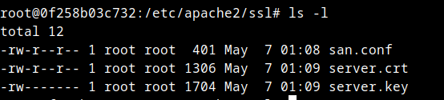

Este certificado SSL se puede usar para habilitar **HTTPS en Apache** para un entorno local o de pruebas. No está firmado por una entidad certificadora reconocida, por lo que los navegadores lo marcarán como 
"_no seguro_" pero es útil para el desarrollo.

#### Método 2: Obtener Certificado en un servidor Linux usando Let's Encrypt y Certbot
---

El objetivo de [Let’s Encrypt[(https://letsencrypt.org/es/how-it-works/) y el protocolo ACME es hacer posible configurar un servidor HTTPS y permitir que este genere automáticamente un certificado válido para navegadores, sin ninguna intervención humana. Esto se logra ejecutando un agente de administración de certificados en el servidor web.

✅ Requisitos previos

Antes de empezar, debemos asegurarnos que:

- Tenemos acceso SSH como usuario root o con privilegios de sudo.

- El puerto 80 (HTTP) y 443 (HTTPS) están abiertos en el firewall.

- Tenemos un nombre de dominio registrado apuntando a la IP pública del servidor.

Hasta ahora hemos hecho todos los ejercicios en nuestro servidor local `localhost`. Si queremos obtener un certificado en Let`s Encrypt debemos de tener un dominio registrado o bien nuestro servidor en un sitio de hosting.

Podemos obtener un dominio gratuito en webs como `duckdns.org` o `no-ip.org`. Vamos a crear uno

**📥 Paso 1: Registrar un dominio a nuestro nombre**.

Normalmente es necesario adquirir un dominio para nuestra organización. Si embargo podemos obtener un dominio y asociarlo a una IP dinámica de forma gratuita.

En esta ocasión he elegido [Duck DNS](https://www.duckdns.org/).

- Iniciamos sesión con una cuenta de Gmail, github, etc.

- Introducimos el nombre de dominio que queremos y comprobamos que está disponible. Lógicamente, nuestro nombre de dominio será un subdominio de Duck DNS. En mi caso he generado `ppsiesvalledeljerteplasencia.duckdns.org`. Además la asociará con la dirección ip que detecta en ese momento.


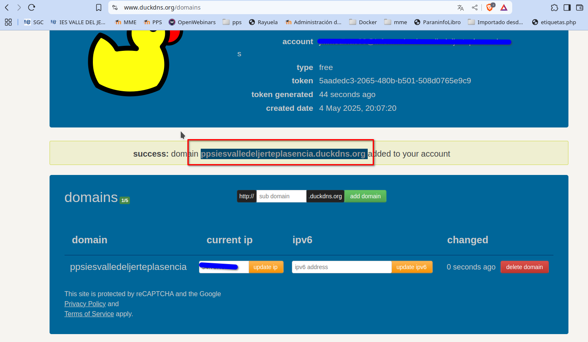

- Ahora que tenemos un nombre de dominio registrado, debemos modificar el `ServerName` del fichero de configuración de nuestro host virtual `/etc/apache2/sites-available/default-ssl.conf` o el fichero de configuración del host virtual que deseemos.


- Para poder acceder a ella tendremos que añadirla en nuestro ficherto /etc/hosts, y abrir posteriormente los puertos de nuestro router, pera ya lo veremos más adelante. Lógicamente, esto último no lo podemos hacer en nuestro centro, tendremos que limitarlo a hacerlo en su caso en nuestra casa.
 `


Podemos comprobar que funciona todo con el siguiente comando:

~~~
nslookup http://ppsiesvalledeljerteplasencia.duckdns.org/
~~~

Una vez registrado el dominio, procedemos con la obtención del certificado:

**📥 Paso 2: Instalar Certbot**

~~~
apt update
apt install certbot python3-certbot-apache
~~~


**🌐 Paso 3: Publicar nuestro servidor web.**

Crear un servidor en un sitio de hosting o bien si estamos usando nuestr servidor local, deberemos de abrir los puertos de nuestro router para que sea accesible desde el exterior.

Si no es accesible desde el exterior el siguiente paso nos dará un error.

**🔑 Paso 4: Obtener el certificado SSL**

~~~
certbot --apache
~~~
Durante el proceso:

- Se verificará que el dominio apunte correctamente al servidor.

- Se te pedirá un correo electrónico.

- Se te pedirá que aceptes la licencia.

- Se te pedirá permiso de uso de tu correo para fines de la organización.

- Si tienes creado los archivos de configuración de varios servidores, te pedirá que indiques para cuál o cuales de ellos lo quieres.

- Se te preguntará si deseas redirigir automáticamente de HTTP a HTTPS (recomendado).


**🌐 Paso 5: Verificar HTTPS**

Accede a tu sitio en el navegador usando: `https://tudominio.com`

Deberías ver el candado que indica que la conexión es segura.


**🔄 Paso 6: Renovación automática del certificado**

Let's Encrypt emite certificados válidos por 90 días. Certbot configura automáticamente la renovación.

Puedes probarla con:

~~~
sudo certbot renew --dry-run
~~~


### Configurar Apache para usar HTTPS
---

Una vez que tengas el certificado y la clave privada, debes configurar Apache para utilizarlos.


Editar el archivo de configuración de Apache `default-ssl.conf`:

~~~
nano /etc/apache2/sites-available/default-ssl.conf
~~~

Lo modificamos y dejamos así:

~~~
<VirtualHost *:80>

    ServerName www.pps.edu

    ServerAdmin webmaster@localhost
    DocumentRoot /var/www/html

    ErrorLog ${APACHE_LOG_DIR}/error.log
    CustomLog ${APACHE_LOG_DIR}/access.log combined

</VirtualHost>

<VirtualHost *:443>
    ServerName www.pps.edu

    # activar uso del motor de protocolo SSL
    SSLEngine on
    SSLCertificateFile /etc/apache2/ssl/localhost.crt
    SSLCertificateKeyFile /etc/apache2/ssl/localhost.key

    DocumentRoot /var/www/html
</VirtualHost>
~~~

Date cuenta que hemos creado un **servidor virtual** con nombre **www.pps.edu**. A partir de ahora tendremos que introducir en la barra de dirección del navegador `https://www.pps.edu` en vez de `https://localhost`.

### Habilitar SSL y el sitio:
---

En el servidor Apache, activamos **SSL** mediante la habilitación de la configuración `default-ssl.conf`que hemos creado:

Fíjate que  tenemos todavía habilitado la configuración del sitio por defecto `000-default.conf`, y que en la configuración `default-ssl`estamos configurando tanto el puerto `http` **Puerto 80** como el puerto de `https`**Puerto 443**.

Por lo tanto deberíamos deshabilitar la configuración por defecto:

```apache
a2dissite 000-default.conf
```

Para habilitar ssl y la configuración de ssl realizamos:

```bash 
a2enmod ssl
a2ensite default-ssl.conf
service apache2 reload
```


### Resolución local de nombres: dns o fichero **/etc/hosts**

Nuestro navegador resuleve la dirección www.google.com o cualquier otra asociándole la ip donde se encuentra en el servidor, eso es debido a la resolución de servidores dns.

En el caso de nuestros sitios virtuales, si no están incluidos en los servidores dns, para hacer pruebas en nuestro ordenador, hemos de modificar las rutas en nuestro equipo para que pueda asociar estos nombres (ficticios) con la ip loc>

Debemos editar el fichero hosts para que nos devuelva la dirección del bucle local (127.0.0.1) cuando el navegador pida la url www.pps.net o cualquier otra asociada con un host virtual.

Este fichero está en /etc/hosts.

archivo `/etc/hosts`
``` 
127.0.0.1       pps.edu www.pps.edu
```

En los casos asociamos los nombres de los host virtuales a localhost tal y como se muestra en la imagen.


Además en el archivo `/etc/hosts` vemos cómo dirección de nuestro servidor apache. En nuestro caso `172.20.0.5`

No obstante puedes consultarlo en docker con el comando:

~~~
docker inspect lamp-php83 |grep IPAddress
~~~

Si queremos acceder a este servidor virtual desde otros equipos de la red, o si estamos utilizando docker y queremos acceder a ellos desde nuestro navegador, tenemos que añadir en el /etc/hosts una linea que vincule la dirección ip con >


Ahora el servidor soportaría **HTTPS**. Accedemos al servidor en la siguiente dirección: `https://www.pps.edu`

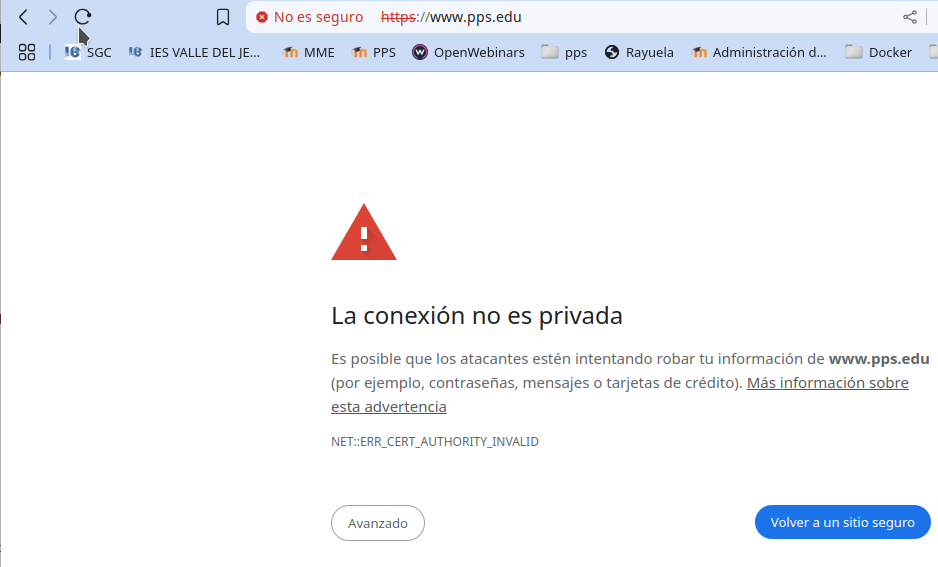

Nos dá un aviso de que es un servidor inseguro, por lo que pulsamos `avanzado`y `Acceder a sitio inseguro`.

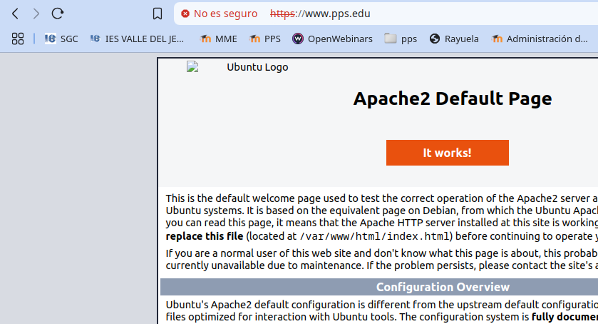

## Verificar la configuración con SSL Labs (con dominio)

Para asegurarse de que la configuración de TLS es segura, se puede comprobar el dominio en: SSL Labs Test. El servidor tiene que ser accesible desde internet. No funcionará en modo local si no abrimos los puertos de nuestro router.

<https://www.ssllabs.com/ssltest/>

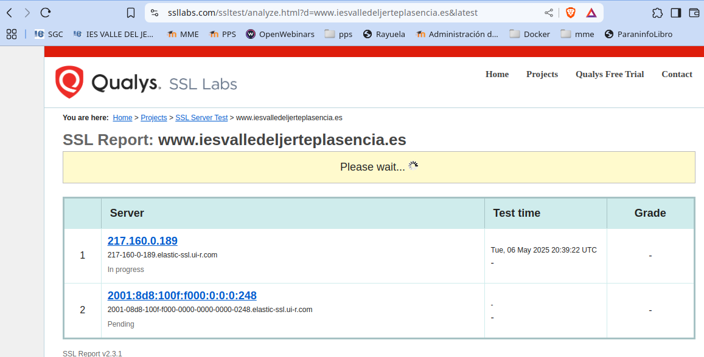

Además podemos obtener información extensa sobre el certificado y `SSL`.

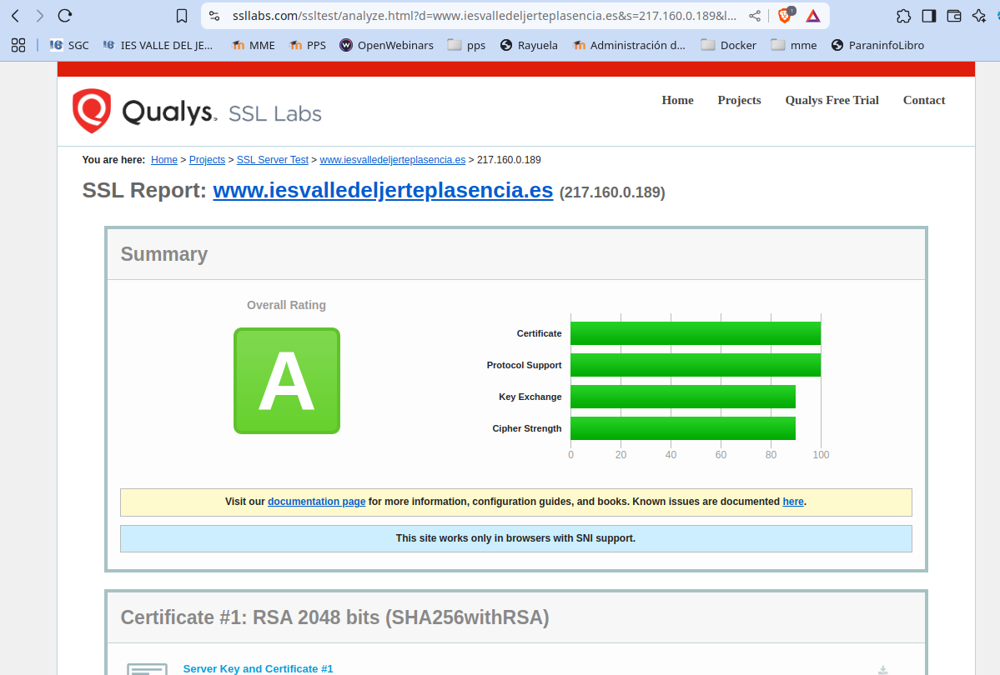

## ¿Cómo eliminar la advertencia del candado? (Opcional)

Si solo trabajas en local, no hay problema en ignorar la advertencia. Pero si se quiere que el navegador lo reconozca como seguro sin advertencias, dado que Firefox solo permite importar certificados de CA en la pestaña "Authorities", se debe generar un certificado raíz de CA y luego firmar el certificado con él.

1. Crear un Certificado de Autoridad (CA)

- Ejecutar estos comandos para generar una CA local:
``` bash
mkdir -p /etc/apache2/ssl
cd /etc/apache2/ssl
```

- Generar la clave privada de la CA
``` bash
openssl genrsa -out myCA.key 2048
```
- Generar el certificado raíz de la CA (válido por 10 años)
``` bash
openssl req -x509 -new -nodes -key localhost.key -sha256 -days 3650 -out MyCA.pem -subj "/C=ES/ST=Extremadura/L=Plasencia/O=MyCompany/OU=MiDepartmen/CN=MiEntidadCA"
```

2. Firmar el Certificado SSL con la CA Local

- Podemos enerar una clave para el servidor Apache:

``` bash
openssl genrsa -out localhost.key 2048
```
Aunque ya la tenemos creada anteriormente con nombre localhost.key

-Crear una solicitud de firma (CSR Certificate Signing Request, es un archivo que contiene información sobre una entidad que solicita un certificado SSL/TLS):
``` bash
openssl req -new -key localhost.key -out server.csr -subj "/C=ES/ST=Extremadura/L=Plasencia/O=MyCompany/OU=MiDepartamento/CN=localhost"
```

- Firmar el certificado con nuestra CA local:
``` bash
openssl x509 -req -in server.csr -CA myCA.pem -CAkey myCA.key -CAcreateserial -out server.crt -days 365 -sha256
```
Ahora disponemos de un certificado server.crt firmado por nuestra CA myCA.pem.

3. Configurar Apache con el Nuevo Certificado
Asegurar de que Apache use los nuevos certificados. Para ello modificar:
sudo mousepad /etc/apache2/sites-available/default-ssl.conf
Cambiar las rutas para que apunten a:
SSLEngine on
SSLCertificateFile /etc/apache2/ssl/server.crt
SSLCertificateKeyFile /etc/apache2/ssl/server.key
SSLCertificateChainFile /etc/apache2/ssl/myCA.pem
Guardar y reiniciar Apache:
sudo systemctl restart apache2
4. Importar la CA en Firefox
Importar myCA.pem en la pestaña "Authorities" de Firefox:
1.
 Abrir Firefox e ir a about:preferences#privacy
2.
 En Certificados y seleccionar Ver certificados
3.
 En la pestaña Autoridades y seleccionar Importar...
4.
 Seleccionar /etc/apache2/ssl/myCA.pem
5.
 Marcar la casilla "Confiar en esta CA para identificar sitios web"
6.
 Guardar los cambios.
Firefox confiará en los certificados firmados por esta CA, y la advertencia desaparecerá.


### 🔒 Forzar HTTPS en Apache2 (default.conf y .htaccess)

### 1. Configuración en `default.conf` (archivo de configuración de Apache)

Edita tu archivo de configuración del sitio (por ejemplo `/etc/apache2/sites-available/000-default.conf`).

Tienes dos opciones:

**Opción a) Usar `Redirect` directo**

~~~
<VirtualHost *:80>
    ServerName pps.edu
    ServerAlias www.pps.edu

    Redirect permanent / https://pps.edu/
</VirtualHost>

<VirtualHost *:443>
    ServerName pps.edu
    DocumentRoot /var/www/html

    SSLEngine on
    SSLCertificateFile /ruta/al/certificado.crt
    SSLCertificateKeyFile /ruta/a/la/clave.key
    SSLCertificateChainFile /ruta/a/la/cadena.crt

    # Configuración adicional para HTTPS
</VirtualHost>
~~~

---

** Opción b) Usar `RewriteEngine` para mayor flexibilidad**
```apache
<VirtualHost *:80>
    ServerName pps.edu
    ServerAlias www.pps.edu

    RewriteEngine On
    RewriteCond %{HTTPS} off
    RewriteRule ^ https://%{HTTP_HOST}%{REQUEST_URI} [L,R=301]
</VirtualHost>
```

---

### 2. Configuración en `.htaccess`

Si prefieres hacerlo desde un `.htaccess` en la raíz del proyecto:

~~~
RewriteEngine On

# Si no está usando HTTPS
RewriteCond %{HTTPS} !=on
RewriteRule ^ https://%{HTTP_HOST}%{REQUEST_URI} [L,R=301]
~~~

> 🔥 **Recuerda:** Para que `.htaccess` funcione correctamente, en tu `default.conf` debes tener habilitado `AllowOverride All`:

~~~
<Directory /var/www/html>
    AllowOverride All
</Directory>
~~~

También asegúrate que el módulo `mod_rewrite` esté habilitado:

```bash
sudo a2enmod rewrite
sudo systemctl reload apache2
```

---

## 🛡️ Nota de seguridad extra: HSTS (opcional pero recomendado)

Para reforzar aún más tu HTTPS, puedes agregar esta cabecera de seguridad (por ejemplo en tu VirtualHost HTTPS o en `.htaccess`):

```apache
Header always set Strict-Transport-Security "max-age=63072000; includeSubDomains; preload"
```

> Esto obliga a los navegadores a recordar usar siempre HTTPS, protegiendo de ataques de tipo *downgrade*.

**Importante**: Asegúrate de que todo tu sitio funcione bien en HTTPS antes de aplicar HSTS.


-----------------------------------------------------------------------
~~~
apt update;apt install openssl
~~~


~~~
mkdir -p /etc/apache2/ssl 
openssl req -newkey rsa:2048 -nodes -keyout /etc/apache2/ssl/server.key \
-x509 -days 365 -out /etc/apache2/ssl/server.crt \
-subj "/C=US/ST=State/L=City/O=Organization/OU=Department/CN=localhost" \
-addext "basicConstraints=CA:FALSE" \
-addext "subjectAltName=DNS:localhost"
~~~
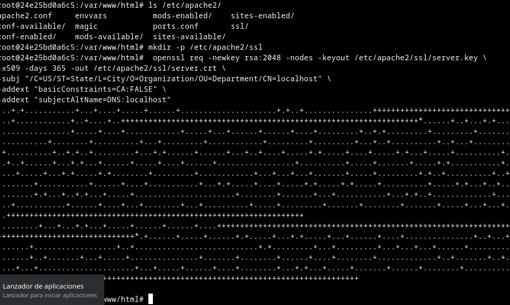

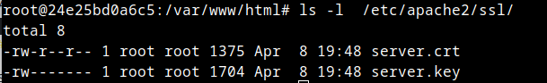

Vemos la versión de ssl:
~~~
openssl version
~~~


Y la versión de apache
~~~
dpkg -l |grep apache
~~~
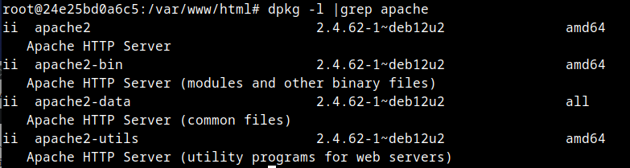

Guardamos el archivo de configuración existente y creamos uno nuevo.
~~~
mv /etc/apache2/sites-available/default-ssl.conf /etc/apache2/sites-available/default-ssl-old
nano /etc/apache2/sites-available/default-ssl.conf
~~~

El nuevo tendrá el siguiente contenido:

~~~
VirtualHost *:443>
        ServerAdmin admin@localhost
        ServerName localhost
        DocumentRoot /var/www/html
        SSLEngine on
        SSLCertificateFile /etc/apache2/ssl/server.crt
        SSLCertificateKeyFile /etc/apache2/ssl/server.key
        SSLProtocol all -SSLv3 -TLSv1 -TLSv1.1
        SSLCipherSuite HIGH:!aNULL:!MD5
</VirtualHost>
~~~
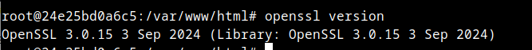

Habilitar SSL y reiniciar Apache
Habilitar el módulo SSL y el sitio seguro:


~~~
a2enmod ssl
a2ensite default-ssl
~~~

Reiniciar Apache para aplicar los cambios:
~~~
service apache2 reload
~~~
Comprueba que tu servidor apache tiene el archivo index.html. Si no es así, [descárgalo de aquí.](files/index.html)
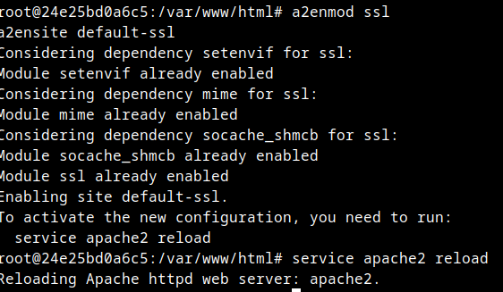

Abrimos navegador y lanzamos: `https://localhost/index.html`

Nos muestra advertencia de conexión no privada

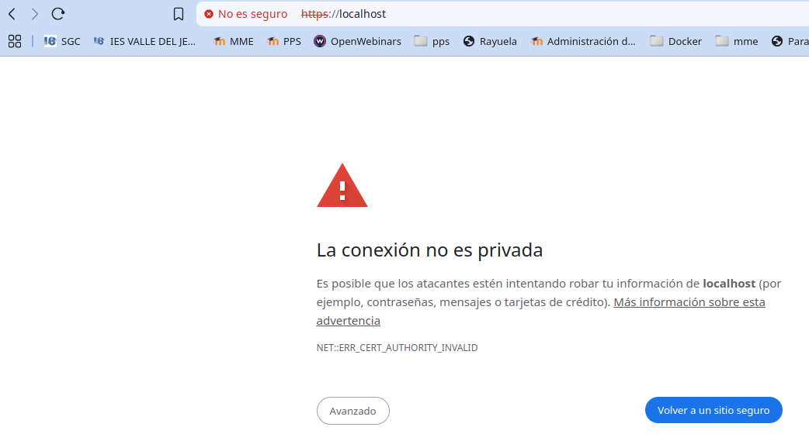

Pulsamos en **Avanzado** y **Acceder a localhost (sitio no seguro)**

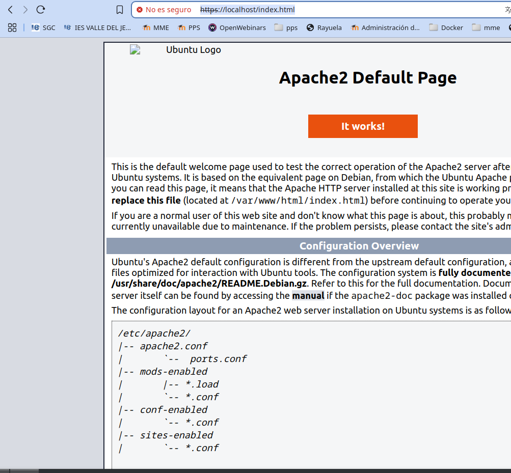

### Verificar la configuración con SSL Labs (con dominio)

Para asegurarse de que la configuración de TLS es segura, se puede comprobar el dominio en: SSL Labs Test

~~~
<https://www.ssllabs.com/ssltest/>
~~~


### Deshabilitar versiones inseguras de TLS

Para evitar vulnerabilidades, en default-ssl.conf configurar:

SSLProtocol TLSv1.2 TLSv1.3

~~~
nano /etc/apache2/sites-available/default-ssl.conf
~~~


~~~
SSLProtocol TLSv1.2 TLSv1.3
~~~

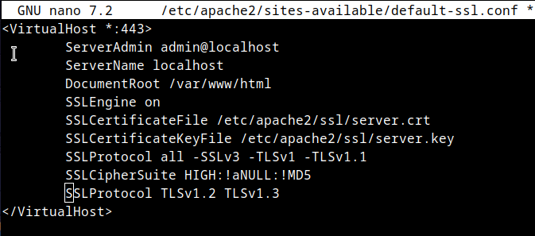

 y reiniciamos el servicio apache2

~~~
service apache2 reload
~~~

### * Forzar HTTPS con HSTS

Añadir dentro del bloque <VirtualHost *:443>:

~~~
Header always set Strict-Transport-Security "max-age=31536000; includeSubDomains; preload"
~~~

Habilitar los encabezados HTTP y reiniciar Apache con:

~~~
a2enmod headers
service apache2 restart
~~~

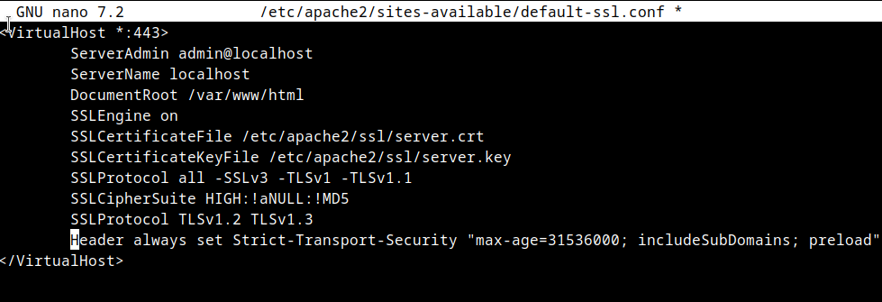

 Se nos cerrará el contenedor docker, o sea que volvemos a iniciarlo.

~~~
docker-compose start
~~~

* Verificar la conexión HTTPS
Para comprobar si HTTPS funciona correctamente, acceder a:
https://localhost
Si se observa el candado en la barra de direcciones, TLS está activo.


### ¿Cómo eliminar la advertencia del candado? (Opcional)

Si solo trabajas en local, no hay problema en ignorar la advertencia. Pero si se quiere que el navegador lo reconozca como seguro sin advertencias, dado que Firefox solo permite importar certificados de CA en la pestaña "Authorities", se debe generar un certificado raíz de CA y luego firmar el certificado con él.

1. **Crear un Certificado de Autoridad (CA)**

Ejecutar estos comandos para generar una CA local:

~~~
mkdir -p /etc/apache2/ssl
cd /etc/apache2/ssl

# Generar la clave privada de la CA
openssl genrsa -out myCA.key 2048

# Generar el certificado raíz de la CA (válido por 10 años)
openssl req -x509 -new -nodes -key myCA.key -sha256 -days 3650 -out myCA.pem \ -subj "/C=ES/ST=Extremadura/L=Plasencia/O=CiberseguridadJoseMI/OU=Soy Yo solo /CN=localhost"
~~~

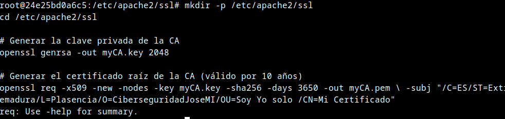

2. **Firmar el Certificado SSL con la CA Local**

Generar una clave para el servidor Apache:

~~~
cd /etc/apache2/ssl
openssl genrsa -out MiServidor.key 2048
~~~

Crear una solicitud de firma (CSR Certificate Signing Request, es un archivo que contiene información sobre una entidad que solicita un certificado SSL/TLS):
~~~
openssl req -new -key MiServidor.key -out MiServidor.csr \ -subj "/C=ES/ST=Extremadura/L=Plasencia/O=CiberseguridadJoseMI/OU=Soy Yo solo /CN=localhost"
~~~

Firmar el certificado con nuestra CA local:

~~~
openssl x509 -req -in MiServidor.csr -CA myCA.pem -CAkey myCA.key -CAcreateserial -out MiServidor.crt -days 365 -sha256
~~

Ahora disponemos de un certificado server.crt firmado por nuestra CA myCA.pem.

~~~
~~~


## ANEXO II

Se puede verificar de manera local que la configuración TLS está funcionando correctamente, especialmente útil
cuando:
•
•
•
No se dispone de un dominio público.
Se está trabajando en un entorno de desarrollo o laboratorio.
Se quiere confirmar que TLS 1.3 está habilitado y operativo antes de poner el servidor en producción.
openssl s_client -connect localhost:443 -tls1_3
Este comando:
•
 Intenta establecer una conexión TLS específicamente con la versión 1.3.
•
 Muestra un resumen de la negociación TLS, incluyendo:
o La versión del protocolo usada.
o El certificado presentado.
o El conjunto de cifrado negociado.
Si se obtiene en la salida:
Protocol
 : TLSv1.3
Cipher
 : TLS_AES_256_GCM_SHA384
... entonces TLS 1.3 está activo y funcionando.


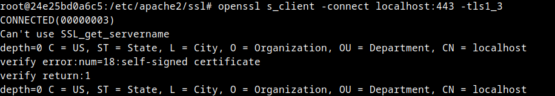
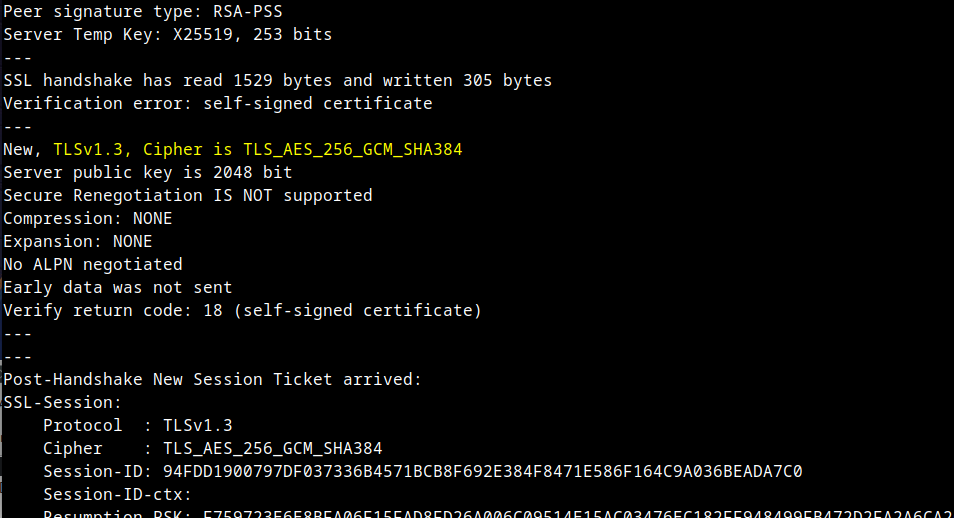


## Código vulnerable
---


### **Código seguro**
---

Aquí está el código securizado:

🔒 Medidas de seguridad implementadas

- :

        - 

        - 


🚀 Resultado

✔ 

✔ 

✔ 

## ENTREGA

> __Realiza las operaciones indicadas__

> __Crea un repositorio  con nombre PPS-Unidad3Actividad6-Tu-Nombre donde documentes la realización de ellos.__

> No te olvides de documentarlo convenientemente con explicaciones, capturas de pantalla, etc.

> __Sube a la plataforma, tanto el repositorio comprimido como la dirección https a tu repositorio de Github.__

# Guía Didáctica: Funcionamiento y Configuración de TLS

---


## 2. Configuración de TLS

### 2.1 Certificados autofirmados con OpenSSL

Para entornos de prueba o desarrollo, se puede utilizar un **certificado autofirmado**, es decir, un certificado que no ha sido emitido por una entidad de certificación (CA), sino por uno mismo. Aunque no es válido en producción, permite entender el proceso de configuración.

#### Paso 1: Crear la clave privada y el certificado

```bash
openssl req -x509 -nodes -newkey rsa:2048 -keyout server.key -out server.crt -days 365
```

**Explicación de los parámetros del comando:**

- `req`: inicia la generación de una solicitud de certificado.
- `-x509`: crea un certificado autofirmado en lugar de una CSR.
- `-nodes`: omite el cifrado de la clave privada, evitando el uso de contraseña.
- `-newkey rsa:2048`: genera una nueva clave RSA de 2048 bits.
- `-keyout server.key`: nombre del archivo que contendrá la clave privada.
- `-out server.crt`: nombre del archivo de salida para el certificado.
- `-days 365`: el certificado será válido por 365 días.

Durante la ejecución del comando, se te solicitará que completes datos como país, nombre de organización, y nombre común (dominio).

### 2.2 Certificados de Let's Encrypt

**Let's Encrypt** es una autoridad certificadora gratuita y automatizada, ideal para sitios en producción.

#### Paso 1: Instalar Certbot

En distribuciones basadas en Debian:

```bash
sudo apt update
sudo apt install certbot python3-certbot-apache
```

#### Paso 2: Obtener el certificado

```bash
sudo certbot --apache
```

Este comando detectará automáticamente tu configuración de Apache y te guiará para activar HTTPS en tus sitios. Necesitarás tener el dominio apuntando correctamente al servidor.

#### Renovación automática

Certbot configura automáticamente la renovación automática usando cron o systemd. Puedes comprobarlo con:

```bash
sudo certbot renew --dry-run
```

---

## 3. Configurar Apache para usar TLS

Una vez que tengas el certificado y la clave privada, debes configurar Apache para utilizarlos.

Edita el archivo de configuración SSL, por ejemplo: `/etc/apache2/sites-available/default-ssl.conf`

```apacheconf
<VirtualHost *:443>
    ServerName www.ejemplo.com

    SSLEngine on
    SSLCertificateFile /etc/ssl/certs/server.crt
    SSLCertificateKeyFile /etc/ssl/private/server.key

    DocumentRoot /var/www/html
</VirtualHost>
```

Luego habilita SSL y el sitio:

```bash
sudo a2enmod ssl
sudo a2ensite default-ssl.conf
sudo systemctl reload apache2
```

Si usas Let's Encrypt, las rutas serán distintas (por ejemplo `/etc/letsencrypt/live/tu_dominio/fullchain.pem`).

---

## 4. Verificación de la configuración TLS

### Desde línea de comandos

Puedes usar OpenSSL para verificar la conexión TLS:

```bash
openssl s_client -connect tu_dominio:443
```

Este comando muestra detalles del certificado, protocolos admitidos, y cifrados utilizados.

### Desde herramientas online

- **SSL Labs** de Qualys: [https://www.ssllabs.com/ssltest/](https://www.ssllabs.com/ssltest/)

Introduce tu dominio y te generará un informe completo con puntuación, algoritmos, versiones TLS activas y problemas potenciales.

---

## 5. Mitigación de problemas

### 5.1 Deshabilitar versiones inseguras de TLS

Algunas versiones de TLS y SSL están obsoletas y deben desactivarse. Edita `/etc/apache2/mods-available/ssl.conf`:

```apacheconf
SSLProtocol all -SSLv2 -SSLv3 -TLSv1 -TLSv1.1
```

Esto asegura que solo TLS 1.2 y 1.3 estén habilitados.

### 5.2 HSTS (HTTP Strict Transport Security)

**HSTS** es una política de seguridad que obliga al navegador a acceder siempre mediante HTTPS, incluso si el usuario escribe el dominio sin "https://".

Agrega este encabezado en la configuración del sitio:

```apacheconf
Header always set Strict-Transport-Security "max-age=31536000; includeSubDomains; preload"
```

Esto indica que:
- Se usará HTTPS por al menos 1 año (`max-age=31536000`)
- Incluye subdominios
- Se puede incluir en la lista de precarga de navegadores

Habilita el módulo `headers` si no está activo:

```bash
sudo a2enmod headers
sudo systemctl restart apache2
```

---

## 6. Otras buenas prácticas

- **Redirigir HTTP a HTTPS** automáticamente, por ejemplo con:

```apacheconf
<VirtualHost *:80>
    ServerName www.ejemplo.com
    Redirect permanent / https://www.ejemplo.com/
</VirtualHost>
```

- **Certificados de 2048 bits o superiores**
- **Habilitar Forward Secrecy** (viene por defecto con TLS 1.3)
- **Revisar caducidad de certificados** y configurar alertas si es necesario
- **Evitar cifrados débiles**, configurando los parámetros `SSLCipherSuite` correctamente

---

Esta guía está diseñada para ayudarte a enseñar cómo funciona TLS desde una perspectiva teórica y práctica. Puedes complementar esta información con laboratorios de configuración y análisis de vulnerabilidades usando herramientas como Wireshark o burp suite para mostrar cómo TLS protege los datos en tránsito.

# Guía Didáctica: Funcionamiento y Configuración de TLS

---

## 1. ¿Qué es TLS?

**TLS (Transport Layer Security)** es un protocolo criptográfico que proporciona comunicaciones seguras sobre redes de computadoras, especialmente en internet. Su objetivo principal es proteger la confidencialidad e integridad de los datos transmitidos entre aplicaciones, como navegadores web y servidores.

TLS es el sucesor de **SSL (Secure Sockets Layer)**. Aunque SSL fue ampliamente utilizado, sus versiones han quedado obsoletas debido a múltiples vulnerabilidades. Hoy en día, TLS en sus versiones 1.2 y 1.3 es el estándar de facto para la seguridad en la web.

**TLS proporciona:**

- **Confidencialidad:** gracias al cifrado de los datos en tránsito.
- **Integridad:** mediante funciones hash que detectan alteraciones.
- **Autenticación:** utilizando certificados digitales que identifican a las partes.

---

## 2. Configuración de TLS

### 2.1 Certificados autofirmados con OpenSSL

Para entornos de prueba o desarrollo, se puede utilizar un **certificado autofirmado**, es decir, un certificado que no ha sido emitido por una entidad de certificación (CA), sino por uno mismo. Aunque no es válido en producción, permite entender el proceso de configuración.

#### Paso 1: Crear la clave privada y el certificado

```bash
openssl req -x509 -nodes -newkey rsa:2048 -keyout server.key -out server.crt -days 365
```

**Explicación de los parámetros del comando:**

- `req`: inicia la generación de una solicitud de certificado.
- `-x509`: crea un certificado autofirmado en lugar de una CSR.
- `-nodes`: omite el cifrado de la clave privada, evitando el uso de contraseña.
- `-newkey rsa:2048`: genera una nueva clave RSA de 2048 bits.
- `-keyout server.key`: nombre del archivo que contendrá la clave privada.
- `-out server.crt`: nombre del archivo de salida para el certificado.
- `-days 365`: el certificado será válido por 365 días.

Durante la ejecución del comando, se te solicitará que completes datos como país, nombre de organización, y nombre común (dominio).

### 2.2 Certificados de Let's Encrypt

**Let's Encrypt** es una autoridad certificadora gratuita y automatizada, ideal para sitios en producción.

#### Paso 1: Instalar Certbot

En distribuciones basadas en Debian:

```bash
sudo apt update
sudo apt install certbot python3-certbot-apache
```

#### Paso 2: Obtener el certificado

```bash
sudo certbot --apache
```

Este comando detectará automáticamente tu configuración de Apache y te guiará para activar HTTPS en tus sitios. Necesitarás tener el dominio apuntando correctamente al servidor.

#### Renovación automática

Certbot configura automáticamente la renovación automática usando cron o systemd. Puedes comprobarlo con:

```bash
sudo certbot renew --dry-run
```

---

## 3. Configurar Apache para usar TLS

Una vez que tengas el certificado y la clave privada, debes configurar Apache para utilizarlos.

Edita el archivo de configuración SSL, por ejemplo: `/etc/apache2/sites-available/default-ssl.conf`

```apacheconf
<VirtualHost *:443>
    ServerName www.ejemplo.com

    SSLEngine on
    SSLCertificateFile /etc/ssl/certs/server.crt
    SSLCertificateKeyFile /etc/ssl/private/server.key

    DocumentRoot /var/www/html
</VirtualHost>
```

Luego habilita SSL y el sitio:

```bash
sudo a2enmod ssl
sudo a2ensite default-ssl.conf
sudo systemctl reload apache2
```

Si usas Let's Encrypt, las rutas serán distintas (por ejemplo `/etc/letsencrypt/live/tu_dominio/fullchain.pem`).

---

## 4. Verificación de la configuración TLS

### Desde línea de comandos

Puedes usar OpenSSL para verificar la conexión TLS:

```bash
openssl s_client -connect tu_dominio:443
```

Este comando muestra detalles del certificado, protocolos admitidos, y cifrados utilizados.

### Desde herramientas online

- **SSL Labs** de Qualys: [https://www.ssllabs.com/ssltest/](https://www.ssllabs.com/ssltest/)

Introduce tu dominio y te generará un informe completo con puntuación, algoritmos, versiones TLS activas y problemas potenciales.

---

## 5. Mitigación de problemas

### 5.1 Deshabilitar versiones inseguras de TLS

Algunas versiones de TLS y SSL están obsoletas y deben desactivarse. Edita `/etc/apache2/mods-available/ssl.conf`:

```apacheconf
SSLProtocol all -SSLv2 -SSLv3 -TLSv1 -TLSv1.1
```

Esto asegura que solo TLS 1.2 y 1.3 estén habilitados.

### 5.2 HSTS (HTTP Strict Transport Security)

**HSTS** es una política de seguridad que obliga al navegador a acceder siempre mediante HTTPS, incluso si el usuario escribe el dominio sin "https://".

Agrega este encabezado en la configuración del sitio:

```apacheconf
Header always set Strict-Transport-Security "max-age=31536000; includeSubDomains; preload"
```

Esto indica que:
- Se usará HTTPS por al menos 1 año (`max-age=31536000`)
- Incluye subdominios
- Se puede incluir en la lista de precarga de navegadores

Habilita el módulo `headers` si no está activo:

```bash
sudo a2enmod headers
sudo systemctl restart apache2
```

---

## 6. Otras buenas prácticas

- **Redirigir HTTP a HTTPS** automáticamente, por ejemplo con:

```apacheconf
<VirtualHost *:80>
    ServerName www.ejemplo.com
    Redirect permanent / https://www.ejemplo.com/
</VirtualHost>
```

- **Certificados de 2048 bits o superiores**
- **Habilitar Forward Secrecy** (viene por defecto con TLS 1.3)
- **Revisar caducidad de certificados** y configurar alertas si es necesario
- **Evitar cifrados débiles**, configurando los parámetros `SSLCipherSuite` correctamente

---

Esta guía está diseñada para ayudarte a enseñar cómo funciona TLS desde una perspectiva teórica y práctica. Puedes complementar esta información con laboratorios de configuración y análisis de vulnerabilidades usando herramientas como Wireshark o burp suite para mostrar cómo TLS protege los datos en tránsito.

